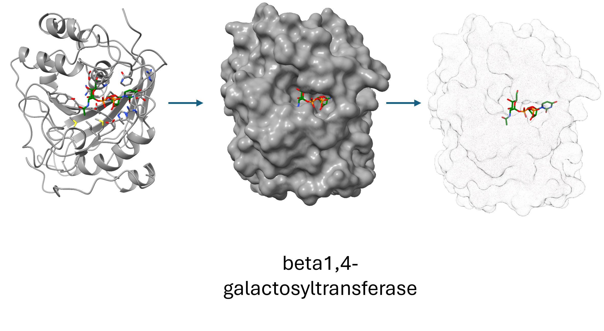
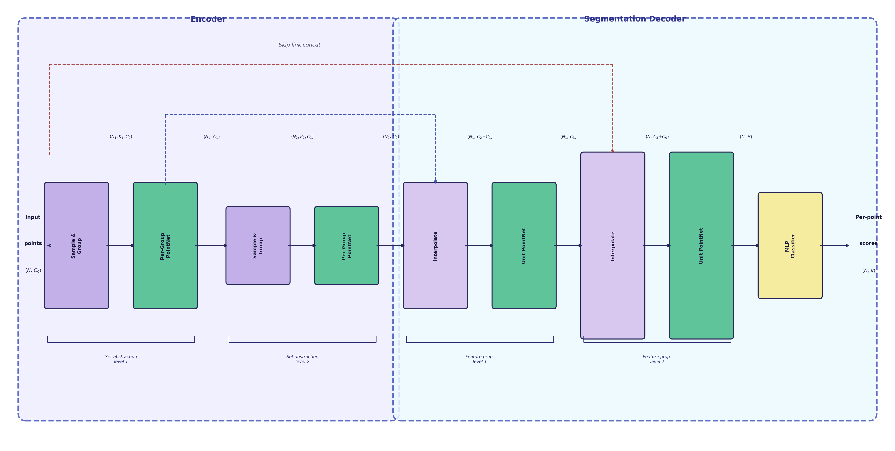
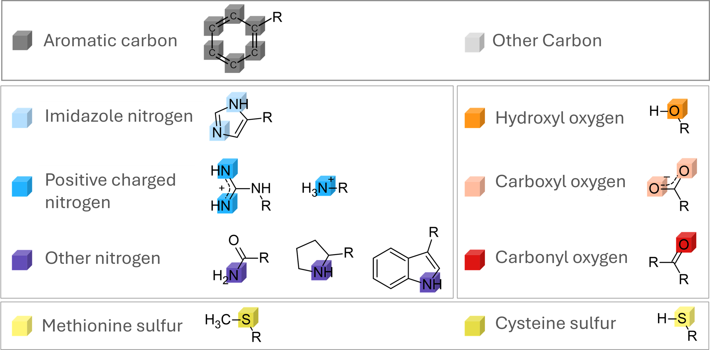

# PocketCraft Ligand-Scale — 3D Ligand Binding Pocket Prediction

**PocketCraft Ligand-Scale** is a PointNet++ segmentation model that predicts **ligand binding pocket residues** directly from protein 3D structures. Given a `.pdb` or `.cif` file, it generates a Solvent Accessible Surface (SAS) point cloud, classifies each surface point as pocket or non-pocket, and maps the results back to specific protein residues with confidence scores.

Three separate pretrained models are provided, each optimised for a different ligand size class: **small**, **medium**, and **large**.

<p align="center">
  
</p>
<p align="center"><em>Protein structure → molecular surface → SAS point cloud fed into PointNet++.</em></p>

---

## Ligand Size Classes

| Weight file | Ligand class | Typical ligand |
|---|---|---|
| `weights/smallligands_best.pth` | Small | Fragments, cofactors, ions |
| `weights/mediumligands_best.pth` | Medium | Drug-like molecules (MW 300–500) |
| `weights/largeligands_best.pth` | Large | Peptides, macrocycles, nucleotides |

Size class boundaries are defined in `ccd_size_class.json`.

<p align="center">
  
</p>
<p align="center"><em>Predicted pocket volumes (coloured) shown on the protein surface for small (blue), medium (lavender), and large (purple) ligands.</em></p>

---

## Model Architecture

<p align="center">
  
</p>

The model is a **U-Net-style PointNet++ segmenter** that performs point-wise binary classification of surface points.

### Forward Pass

1. **Surface generation** — A Solvent Accessible Surface (SAS) is sampled by placing Fibonacci-sphere probe points around each heavy atom. Default: 20 points per atom, probe radius 1.4 Å.

2. **Feature encoding** — Each surface point inherits a weighted combination of nearby atom features. The feature vocabulary covers 11 universal atom-type channels plus per-amino-acid indicators:

<p align="center">
  
</p>
<p align="center"><em>Chemical atom-type vocabulary used to build per-surface-point feature vectors.</em></p>

3. **Encoder — Set Abstraction (SA)**
   - **SA1** (`ratio=0.25`, `r=8.0 Å`) — FPS downsamples to N/4 points; PointNetConv aggregates local features → hidden-dim H
   - **SA2** (`ratio=0.25`, `r=16.0 Å`) — FPS downsamples to N/16 points; PointNetConv aggregates → 2H

4. **Decoder — Feature Propagation (FP)**
   - **FP2** — kNN interpolates 2H features back to N/4; concatenates SA1 skip features (H) → MLP → H
   - **FP1** — kNN interpolates H features back to N; concatenates raw input features (C) → MLP → H

5. **Classifier head** — Linear → ReLU → Dropout → Linear → per-point logit

6. **Residue mapping** — Surface points with `sigmoid(logit) > threshold` are mapped back to the nearest protein residues within a configurable radius (default 4.5 Å).

---

## Installation

```bash
conda env create -f environment.yml
conda activate ligand_pocket
```

The environment provides Python 3.13, PyTorch 2.10 (CUDA 12.6), PyTorch Geometric 2.7, Biotite 1.6, and RDKit 2025.9.

---

## Quick Start — Inference with Pretrained Weights

```bash
python predict.py \
  --input_dir   /path/to/structures \
  --model_path  weights/mediumligands_best.pth \
  --output_dir  /path/to/outputs \
  --model_type  pointnet2 \
  --threshold   0.5
```

Run the command once per ligand class you need. For example, to predict both small- and large-ligand pockets:

```bash
# Small ligands
python predict.py \
  --input_dir  /path/to/structures \
  --model_path weights/smallligands_best.pth \
  --output_dir outputs/small

# Large ligands
python predict.py \
  --input_dir  /path/to/structures \
  --model_path weights/largeligands_best.pth \
  --output_dir outputs/large
```

### What the output looks like

For each input structure `foo.cif` the script writes two files:

**`foo.csv`** — one row per predicted pocket residue, sorted by chain and residue number:

```
chain_id,res_id,res_name,score
A,42,HIS,0.8731
A,43,GLY,0.7105
A,67,CYS,0.9214
...
```

**`foo_residues.txt`** — residue IDs grouped by chain, ready for visualisation in PyMOL or ChimeraX:

```
A:42,43,67,89,90
B:12,13
```

### Inference options

| Flag | Default | Description |
|---|---|---|
| `--input_dir` | required | Directory of `.pdb` / `.cif` structures |
| `--model_path` | required | Path to weight file (e.g. `weights/mediumligands_best.pth`) |
| `--output_dir` | required | Where to write `.csv` and `_residues.txt` files |
| `--model_type` | `pointnet2` | Architecture: `pointnet2`, `dgcnn`, or `pointnet` |
| `--threshold` | `0.5` | Sigmoid probability cutoff for pocket points |
| `--mapping_method` | `radius` | Map surface points to residues: `radius` or `closest` |
| `--radius` | `4.5` Å | Contact radius for `radius` mapping |
| `--hidden_dim` | `64` | Hidden layer width (must match trained checkpoint) |
| `--points_per_atom` | `20` | SAS probe points per heavy atom |
| `--probe_radius` | `1.4` Å | Probe sphere radius for SAS generation |
| `--config` | built-in | Path to atom feature config JSON |

### Single-file example (Python API)

```python
import torch
from torch_geometric.data import Data, Batch
from models.pointnet2 import PointNet2Segmenter
from utils.io import load_config, load_structure
from utils.geometry import generate_surface_points
from utils.features import get_weighted_features
import biotite.structure as struc

FEATURE_CONFIG_PATH = "protein_feature_defaultv2.json"
WEIGHT_PATH = "weights/mediumligands_best.pth"

device = torch.device("cuda" if torch.cuda.is_available() else "cpu")
feat_config = load_config(FEATURE_CONFIG_PATH)
in_channels = 11 + len(feat_config['regular_aa'])

model = PointNet2Segmenter(in_channels, 1, hidden_dim=64).to(device)
model.load_state_dict(torch.load(WEIGHT_PATH, map_location=device))
model.eval()

atoms = load_structure("my_protein.cif")
protein_atoms = atoms[struc.filter_amino_acids(atoms)]
surface_coords = generate_surface_points(protein_atoms, points_per_atom=20, probe_radius=1.4)
cloud_features = get_weighted_features(surface_coords, torch.tensor(protein_atoms.coord).float(),
                                        protein_atoms, feat_config)

data = Data(x=cloud_features, pos=surface_coords)
batch = Batch.from_data_list([data]).to(device)

with torch.no_grad():
    logits = model(batch)
    probs = torch.sigmoid(logits).cpu().numpy()

pocket_mask = probs > 0.5
pocket_coords = surface_coords[pocket_mask]
print(f"Predicted {pocket_mask.sum()} pocket surface points out of {len(probs)} total.")
```

---

## Full Training Pipeline

### 1 — Preprocessing

Convert `.pdb`/`.cif` structures into PyTorch Geometric tensors (`.pt`):

```bash
python preprocess.py \
  --input_dir   /data/raw_structures \
  --output_dir  /data/processed \
  --ligand_dir  /data/ligands \
  --threshold   4.5 \
  --num_workers 16
```

| Option | Default | Description |
|---|---|---|
| `--threshold` | `4.5` Å | Distance from ligand atoms to label surface points as pocket |
| `--points_per_atom` | `20` | SAS probe points per heavy atom |
| `--probe_radius` | `1.4` Å | SAS probe sphere radius |
| `--size_class` | all | Filter to `small`, `medium`, or `large` ligands via `ccd_size_class.json` |
| `--num_workers` | `4` | Parallel worker processes |

### 2 — Training

Three-stage pipeline: self-supervised pre-training → Optuna hyperparameter search → K-fold cross-validation:

```bash
python train.py \
  --dir_train  /data/processed/train \
  --dir_test   /data/processed/test \
  --model_type pointnet2 \
  --in_channels 32 \
  --hidden_dim  64 \
  --epochs      50 \
  --k_folds     5 \
  --pretrain_epochs 15 \
  --n_trials    10 \
  --log_dir     runs/medium_pocket
```

| Option | Default | Description |
|---|---|---|
| `--hidden_dim` | `64` | Node embedding width |
| `--pretrain_epochs` | `15` | Self-supervised pre-training epochs (0 to skip) |
| `--n_trials` | `10` | Optuna search trials |
| `--tuning_epochs` | `15` | Epochs per Optuna trial |
| `--k_folds` | `5` | K-Fold cross-validation splits |
| `--epochs` | `50` | Epochs per fold in final training |
| `--load_pretrained` | — | Skip pre-training; load existing weights |

Best-fold checkpoints are saved as `best_model_fold_N.pth` in `--log_dir`. Final test metrics (loss, PR-AUC, ROC-AUC) are printed per fold with mean ± std.

---

## Repository Layout

```
Pocketcraft_ligand-scale/
├── predict.py               # Batch inference → *.csv + *_residues.txt
├── train.py                 # Training pipeline (pretrain → tune → k-fold)
├── preprocess.py            # PDB/CIF → .pt surface point cloud tensors
│
├── models/
│   ├── pointnet2.py         # PointNet2Segmenter, SAModule, FPModule
│   └── gnn.py               # Alternative GNN architectures (DGCNN, PointNet)
│
├── training/
│   └── trainer.py           # Training loop, pretrain, evaluate helpers
│
├── utils/
│   ├── io.py                # load_config, load_structure
│   ├── geometry.py          # generate_surface_points (SAS sampling)
│   └── features.py          # get_weighted_features (atom → surface encoding)
│
├── data/
│   └── dataset.py           # ProteinPocketDataset (loads .pt tensors)
│
├── weights/
│   ├── smallligands_best.pth    # Pretrained — small ligands
│   ├── mediumligands_best.pth   # Pretrained — medium ligands
│   └── largeligands_best.pth    # Pretrained — large ligands
│
├── figures/
│   ├── architecture.png         # PointNet++ segmenter diagram
│   ├── protein_feature.png      # Structure → surface pipeline
│   ├── lego_feature_scheme.png  # Atom-type feature vocabulary
│   └── ligands_together_example.png  # Pocket prediction examples
│
├── protein_feature_defaultv2.json   # Atom feature configuration
├── ccd_size_class.json              # Ligand size class definitions
└── environment.yml                  # Conda environment
```

---

## Citation

If you use PocketCraft Ligand-Scale in your work, please cite the PocketCraft project.
